# Endorsement process

The **endorsement process** represents the stages a standard needs to go through to get either endorsed or disavowed.

## States

### Endorsed

An endorsed standard is expected to be adopted when they have to address a use case similar to the ones related to the standard.

Any endorsed standard is reviewed periodically until it gets retired or superseded.

## Disavowed

A disavowed standard is not to be used. If a legacy system uses it, it should be flagged as technical debt and corrected when appropriate.

## Proposed

A proposed standard must always be backed by at least one use case part of a consultation process.

## Identified

Any standard can be an identified standard as long as the Data Standards Authority is aware of it.
